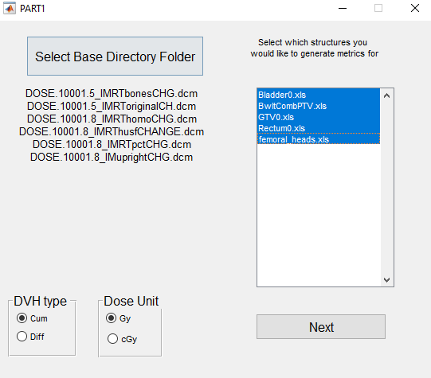
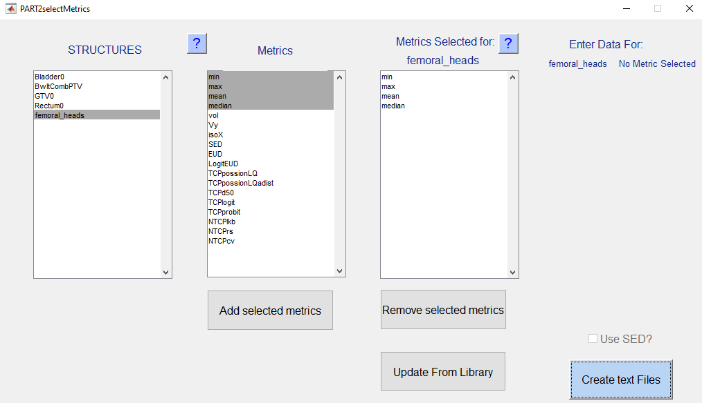

COMP PLAN
=========

**Authors:** Lois Holloway, Brendan Whelan, many others!

**Purpose:** Calculate a wide range of radiobiogical metric from DVH files for radiotherapy treatment planning.

Introduction
------------

For a detailed description of the rational, architecture, and capabilities of this code, please prefer to our
[publication](_resources/2012_Holloway_CompPlan.pdf).

In essence, Comp_Plan_main.m will analyse a *base directory*, which is a folder containing:

1) a series of text files which tells comp_plan what to do
2) the raw data: DVH files in excel format. Column A should contain the dose information, and column B should contain the volume information. 

Although it is completely possible to use CompPlan without utilising any GUIs, it does require the user to manually
create a large number of text files, which can be rather painstaking and error-prone. Therefore, the easiest way to set 
up your base directory is to use the included GUIs. The below workflow will assume that you are starting with dicom-RT
files. If you are instead starting with DVH files, you can skip the first step.

GUI based workflow to set up base directory
-------------------------------------------

1. Use our sister program [DVH_from_dicomRT](https://github.com/bwheelz36/DVH_from_dicomRT) to generate a series of DVHs.
Now you should have a folder containing one subdirectory for each dicom-RT file you created. Within this subdirectory 
should be one excel based DSV file for each structure of interest. If you are skipping this step, you can refer to the 
'example base directory' to see what the structure should look like.
2. Run PART1.m. I'm sorry for the terrible name, but I did this a long time ago and it's quite painful to rename a 
MatlabGUI! From this GUI, you should select the base directory created in step 1 (or you can use the example base directory)
and select each contour you want to generate metrics for. click next.

3. A second GUI will load. This is where you can add all the metrics you are interested in. There's a lot here! for explanation
	of what all these models are and how they work, please refer to our [publication](_resources/2012_Holloway_CompPlan.pdf).
   - In the first column on the structure you would like to add metrics for
   - In the second column, select the metrics you want to calculate using e.g. ctrl and/or shift, and click 'add selected metrics'
   - In the third column, select each metric one by one, and add all necesarry parameters. Again, see our
    [publication](_resources/2012_Holloway_CompPlan.pdf) for details. Note that the 'Reference' field can be left blank -
     this is merely for your own sanity when you try and reproduce your results five years later!
    - Click through each structure in the first column, and check what metrics you have added. Ensure all necessary 
    parameters are entered.  You can add or remove parameters if you want.
    - **hint:** for the purpose of this tutorial, it may be easiest to select a few metrics which require no parameters, 
    e.g. min, max etc.
    - Click 'create text files'. The text files necesary to run comp plan will be added to the base directory.
	

Library directory
-----------------
The above workflow requires one to manually enter parameters for each metric every time. To avoid this, it is also possible
to use the 'update from library' button. the code will scan the library directory and, if possible, automatically populate 
the parameter fields.
Note that although there are a few files in the library directory, it is not our intention to provide this data for all structures
and organs - this is very much the responsibility of the user! 

Instructions for addin metrics to the library are below: 

The easiest way to set up the library folder is to simply copy all the text
files from a previously set up base directory into this directory.
Next time you use the code it will search this directory for available data.

It is a good idea to make sure that all structures in this folder have as generic
a name as possible - i.e. if you have a structure call 'bladder_kl_1' rename it
to 'bladder' in all files. This is because the code will check if this name exists WITHIN any new structures.
So if you check for data for a structure called 'bladder_kl_1' and the Library
has a structure called 'bladder' it should find it - however, the reverse is NOT
true.

Finally, note that this process is not infallible
   - always check the values for each metric before proceeding
   - make sure that the structure names for all library names match - otherwise the code will crash

Analysing a base directory with comp plan
-----------------------------------------

Finally, we arrive at the juicy part!
To analyse the base directory you have created, simply run comp_plan_main.m. If you run it with no inputs, it will load
a GUI where you can point it to your base directory.
Alternatively, you can input the location of the base directory when you call the code, e.g.::

    comp_plan_main('path/to/basedirectory')

After a successful run, you will find a file called metricresults.xls in your base directory. This contains the results 
of all requested metrics, with each organ being displayed on an individual sheet of the xls file. 

There are a few user options you can turn on or off at the top of the page.

**Mode**='singleDirectory'; %'singleDirectory' or 'batch'. Batch simply loops over all supplied directories. **Warning** - I'm
not confident batch mode works properly!

**plotDVHs**=1; % set values below to 1 to plot DVHs, 0 otherwise. Plotting slows code substantially.

**plotparams**=0; % set values below to 1 to add the calculation parameters to the results file
xlnum=1; %position of data in excel, if you wish to add data to a previous file this

License conditions
------------------

This code has **not** been cleared for clinical use.
This program is distributed in the hope that it will be useful, but WITHOUT ANY WARRANTY; without even the implied 
warranty of MERCHANTABILITY or FITNESS FOR A PARTICULAR PURPOSE.
Please refer to the license file for the exact conditions of use. 
